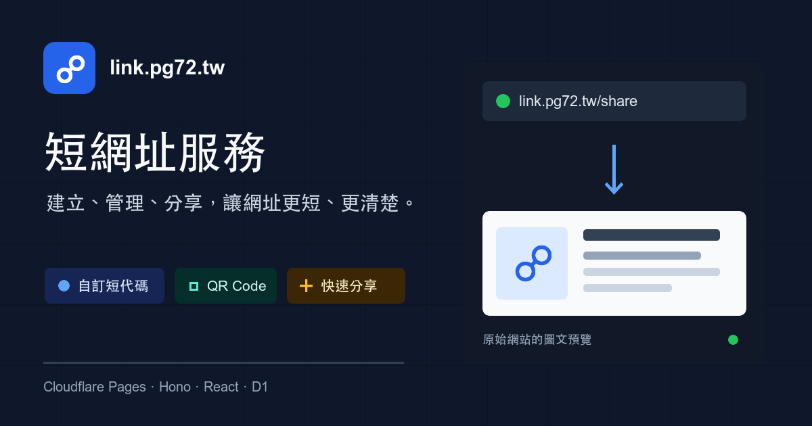
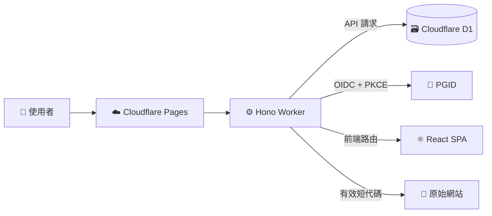
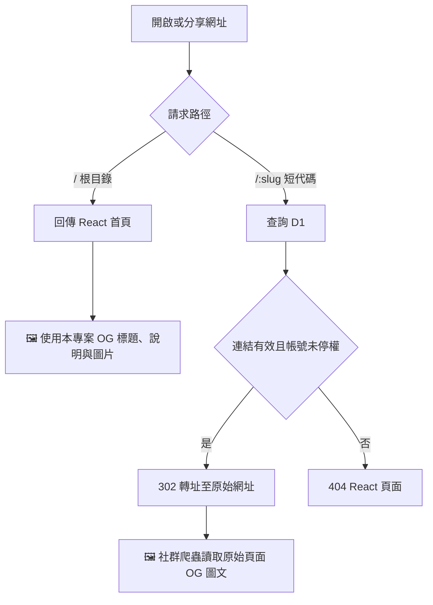
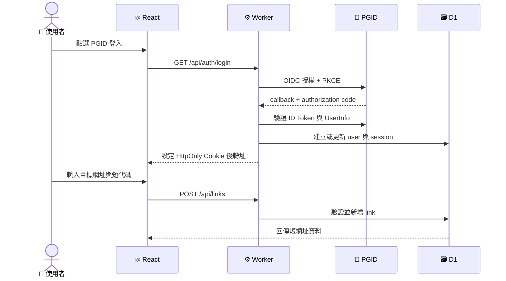

# link.pg72.tw 短網址服務


一個部署在 Cloudflare Pages 的多使用者短網址系統。使用者可以透過 PGID OpenID Connect 登入、建立與管理短網址、產生 QR Code；管理員可管理全站連結與停權帳號。



## 功能

- PGID OIDC Authorization Code + PKCE S256 登入與 7 天 Session
- 自訂或自動產生短代碼
- 建立、編輯、刪除個人短網址
- 複製、系統分享、QR Code 顯示與下載
- 管理員管理所有連結、停用連結、停權使用者
- 根目錄提供 Open Graph / Twitter Card 圖文預覽
- 分享短網址時轉址至原始頁面，由原始網站提供預覽圖文
- 無效、已停用或所有者已停權的連結會顯示 404 頁面

## 圖示說明

| 圖示 | 代表元件 | 說明 |
| --- | --- | --- |
| 👤 | 使用者 | 開啟網站、管理連結或使用短網址的人 |
| 🔐 | PGID | 透過 OIDC 驗證穩定 `sub` 身分 |
| ⚙️ | Worker + Hono | 負責 API、Session、權限、轉址與靜態檔案分流 |
| 🗃️ | Cloudflare D1 | 儲存使用者、Session 與連結 |
| 🧭 | 轉址 | 有效的 `/:slug` 回傳 `302` 到目標網址 |
| 🖼️ | OG 圖文 | 根目錄使用本專案預覽；短網址由原始網站提供預覽 |

## 系統架構



### 短網址與 OG 預覽流程



> [!NOTE]
> 短網址會直接轉址到原始網站，因此預覽的標題、說明與圖片取決於原始頁面的 OG 設定。社群平台可能會快取預覽結果，修改原始頁面後不一定會立即更新。

### 登入與建立連結流程



## 技術堆疊

| 層級 | 技術 | 用途 |
| --- | --- | --- |
| 前端 | React 18、React Router、Tailwind CSS 4 | 登入、連結管理、管理後台與 404 |
| 邊緣後端 | Hono、Cloudflare Pages Advanced Mode | API、OAuth、Session、轉址與靜態檔案 |
| 資料庫 | Cloudflare D1 | `users`、`links`、`sessions` |
| 開發工具 | TypeScript、Vite、esbuild、Wrangler | 開發、型別檢查、建置與部署 |

## 目錄結構

```text
.
├── public/
│   ├── favicon.svg          # 網站圖示
│   ├── og-image.svg         # OG 圖片可編輯原始檔
│   └── og-image.png         # 社群分享用 1200 x 630 圖片
├── src/                        # React SPA
│   ├── components/          # 共用元件
│   └── pages/               # 登入、儀表板、管理與 404
├── src-worker/index.ts         # Hono Worker、API、OAuth、轉址
├── schema.sql                  # 新資料庫完整 schema
├── migration-002.sql           # 舊版資料庫升級檔
├── wrangler.toml               # Pages 與 D1 綁定
├── .dev.vars.example           # 本機環境變數範本
├── index.html                  # SPA 入口與根目錄 OG meta
└── AGENTS.md                  # AI 開發工具操作指南
```

## 使用需求

- Node.js 20 或更新版本
- npm
- Cloudflare 帳號與 Pages 專案
- Cloudflare D1 資料庫
- PGID 機密 OIDC client

## 本機開發

1. 安裝依賴：

   ```bash
   npm ci
   ```

2. 建立本機環境變數：

   ```bash
   cp .dev.vars.example .dev.vars
   ```

   編輯 `.dev.vars`：

   ```dotenv
   APP_BASE_URL=http://localhost:8788
   PG72_ID_ISSUER=https://sso-preview.pg72.tw
   PG72_ID_CLIENT_ID=pg72-link-local
   PG72_ID_CLIENT_SECRET=your-local-client-secret
   BOOTSTRAP_ADMIN_EMAIL=admin@example.com
   ```

   `BOOTSTRAP_ADMIN_EMAIL` 只會在全新資料庫第一次成功綁定時使用。完成後管理權限只來自 D1 `users.is_admin` 與已記錄的 `sso_subject`，不會在每次登入時以 email 判權。

3. 建立本機 D1 資料表：

   ```bash
   npm run db:migrate:local
   ```

4. 建置並啟動完整環境：

   ```bash
   npm run dev:worker
   ```

   預設網址為 `http://localhost:8788`。請在 PGID 註冊本機 callback：

   ```text
   http://localhost:8788/api/auth/callback
   ```

只需開發 UI 時可使用 `npm run dev`，但這個模式沒有 Worker API 與 D1。

## 建置與檢查

```bash
# 前端型別檢查
npx tsc --noEmit

# Worker 型別檢查
npx tsc --noEmit -p tsconfig.worker.json

# 建置 React 與 dist/_worker.js
npm run build
```

`npm run build` 先由 Vite 建置 React，再使用 esbuild 將 `src-worker/index.ts` 輸出為 Cloudflare Pages Advanced Mode 需要的 `dist/_worker.js`。

## 部署

### 1. 註冊 PGID OIDC clients

Link 使用 confidential client、`client_secret_post`、Authorization Code、PKCE S256，scopes 為 `openid email`，且不可略過 consent。註冊以下 redirect URIs：

```text
https://link.pg72.tw/api/auth/callback
https://link-preview.pg72.tw/api/auth/callback
http://localhost:8788/api/auth/callback
```

建議 client IDs 分別為 `pg72-link`、`pg72-link-preview` 與 `pg72-link-local`，三個環境不共用 client secret。

### 2. 建立 D1

```bash
npm run db:create
```

將指令回傳的 `database_id` 填入 `wrangler.toml` 的 `[[d1_databases]]` 區塊，然後套用完整 schema：

```bash
npm run db:migrate
```

只有舊版資料庫才執行 `migration-002.sql`。從現有 Google/email 身分升級時，再執行 `migration-003-pg72-oidc.sql`；這個 migration 會刻意刪除舊 Session，但不會刪除使用者或短網址。

### 3. 設定 Pages

Cloudflare Pages 專案使用以下設定：

| 項目 | 值 |
| --- | --- |
| Build command | `npm run build` |
| Build output directory | `dist` |
| D1 binding | `DB` → `link-short-db` |

在 Settings → Variables and Secrets 加入：

| 名稱 | 類型 | 用途 |
| --- | --- | --- |
| `APP_BASE_URL` | 變數 | 該環境的精確 origin，用於 callback 與 Origin 驗證 |
| `PG72_ID_ISSUER` | 變數 | PGID issuer 精確 origin |
| `PG72_ID_CLIENT_ID` | 變數 | 該環境的 OIDC client ID |
| `PG72_ID_CLIENT_SECRET` | Secret | 該環境的 OIDC client secret |
| `BOOTSTRAP_ADMIN_EMAIL` | 變數或 Secret | 可選，僅限空資料庫的一次管理員 bootstrap |

Preview 環境固定使用 `https://link-preview.pg72.tw`、`https://sso-preview.pg72.tw` 與 `pg72-link-preview`。Preview 必須另外建立 D1 並將 `DB` 綁定到該資料庫；不要讓 Preview 共用正式 `link-short-db`。`wrangler.toml` 刻意不將 Preview DB 指向正式 UUID。

完成後可透過 Cloudflare Git 整合部署，或在已登入 Wrangler 的環境執行：

```bash
npm run deploy
```

## API 摘要

| Method | Path | 權限 | 用途 |
| --- | --- | --- | --- |
| `GET` | `/api/auth/me` | 公開 | 取得目前 Session 使用者 |
| `GET` | `/api/auth/login` | 公開 | 開始 PGID OIDC 登入 |
| `GET` | `/api/auth/callback` | 公開 | OAuth callback |
| `POST` | `/api/auth/logout` | 公開 | 刪除 Session 並登出 |
| `GET` | `/api/links` | 已登入 | 列出自己的連結 |
| `POST` | `/api/links` | 已登入 | 新增短網址 |
| `PUT` | `/api/links/:id` | 擁有者或管理員 | 更新短代碼或目標 |
| `DELETE` | `/api/links/:id` | 擁有者或管理員 | 刪除連結 |
| `GET` | `/api/admin/links` | 管理員 | 列出所有連結 |
| `GET` | `/api/admin/users` | 管理員 | 列出使用者 |
| `POST` | `/api/admin/users/:email/ban` | 管理員 | 停權或解除停權 |
| `POST` | `/api/admin/links/:id/disable` | 管理員 | 停用或啟用連結 |
| `PUT` | `/api/admin/links/:id` | 管理員 | 編輯任意連結 |
| `GET`, `HEAD` | `/:slug` | 公開 | 查詢並 `302` 轉址到目標 |

## 資料表

| 資料表 | 重點欄位 | 用途 |
| --- | --- | --- |
| `users` | `email`, `sso_subject`, `banned`, `is_admin` | 使用者與管理權限 |
| `links` | `slug`, `target_url`, `owner_email`, `active` | 短網址與狀態 |
| `sessions` | `id`, `sso_subject`, `expires_at` | 伺服器端 Session |
| `auth_bootstrap` | `admin_subject`, `completed_at` | 關閉 email bootstrap 後的穩定管理員身分 |

## 安全注意事項

- 不要提交 `.dev.vars`、OAuth Client Secret 或 Session ID。
- OIDC 使用 oauth4webapi 驗證 state、nonce、PKCE、issuer、audience、ID Token 簽章與 UserInfo `sub`。
- OIDC transaction 與 Session Cookie 使用 `HttpOnly`、`Secure`、`SameSite=Lax`；transaction cookie 另以 HMAC 防篡改。
- 舊 Google 使用者只能在第一次 PGID 登入用 verified email 綁定，之後僅使用 `sub`。
- 所有 cookie-authenticated POST/PUT/PATCH/DELETE 都必須帶有與 `APP_BASE_URL` 完全相同的 `Origin`。
- 短網址目標只允許 `http:` 與 `https:`，拒絕 `javascript:`、`data:` 與其他 scheme。
- API 權限在 Worker 驗證，不依賴前端路由保護。
- D1 查詢使用 prepared statement 與 `.bind()`。
- 停權帳號時會一併刪除其現有 Session。

## License

本專案目前未指定授權條款。
